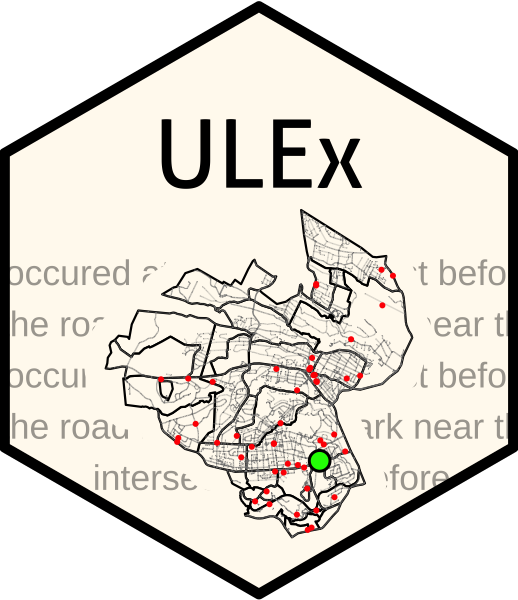

# Unique Location Extractor 

## Overview
Text often contains references to the locations of events where we want to extract the location of the event. For example, consider this example tweet that reports a crash in Nairobi, Kenya, where we are interested in extracting the location of the crash:

> crash occurred near garden city on thika road on your way towards thika mall.

The tweet contains three location references: (1) garden city, (2) thika road and (3) thika mall, where 'garden city' is the name of multiple locations that are over 20 kilometers apart. Here, we are interested in extracting the location of the garden city location on thika road that represents the crash site.

The Unique Location Extractor (ULEx) geoparses text to extract the unique location of events. The algorithm takes advantage of contextual information contained within text (references to roads or administrate areas, such as neighborhoods) and determines which location references should be ignored in order to determine the unique location of events.

This package was originally developed to extract locations of road traffic crashes from reports of crashes via Twitter, specifically in the context of Nairobi, Kenya using the Twitter feed [@Ma3Route](https://twitter.com/Ma3Route?ref_src=twsrc%5Egoogle%7Ctwcamp%5Eserp%7Ctwgr%5Eauthor).

## Installation

``` r
## Dependencies
library(magrittr)
library(lubridate)
library(dplyr)
library(tidyr)
library(readr)
library(purrr)
library(tidytext)
library(stringr)
library(stringi)
library(ngram)
library(hunspell)
library(stringdist)
library(tm)
library(raster)
library(rgeos)
library(parallel)
library(jsonlite)
library(maptools)
library(sf)

## Load functions
source("https://raw.githubusercontent.com/ramarty/Unique-Location-Extractor/master/R/helper_functions.R")
source("https://raw.githubusercontent.com/ramarty/Unique-Location-Extractor/master/R/locate_event.R")
```

## Main functions

#### Augment Gazetteer


## Example

``` r
# Have example data, where geospatial is .geojson


```
